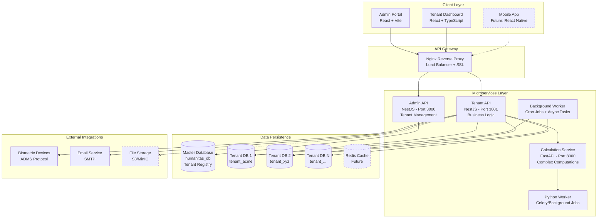

# Humanitas - Future Enterprise Resource Planning (ERP), HR management Platform

[](https://nestjs.com/)
[](https://reactjs.org/)
[](https://www.typescriptlang.org/)
[](https://www.postgresql.org/)
[](https://www.docker.com/)
[](https://fastapi.tiangolo.com/)

> **A production-ready, multi-tenant SaaS ERP platform** for comprehensive enterprise resource management.  
> Currently featuring: HR Management, Payroll Processing, Attendance Tracking, and Project Management.  
> **Future Vision**: Complete ERP suite including Inventory, Procurement, Finance, CRM, and Others.

[🏗️ Architecture](#architecture) | [✨ Features](#features) | [🚀 Tech Stack](#tech-stack) | [📖 Documentation](#documentation)

---

## 🎯 Project Overview

**Humanitas** is an enterprise-grade ERP platform designed from the ground up to serve multiple organizations through a sophisticated **multi-tenant architecture**. Built with scalability, security, and extensibility in mind, it represents a production-ready foundation for a comprehensive business management ecosystem.

### 🌟 **Current Modules**

- ✅ **Human Resources (HR)** - Employee management, organizational structure, categories
- ✅ **Payroll Processing** - Advanced payroll engine with complex calculations
- ✅ **Attendance Management** - Time tracking, biometric integration, shift scheduling
- ✅ **Project Management System (PMS)** - Goal tracking, KPIs, reviews
- ✅ **Leave Management** - Leave requests, approvals, balance tracking
- ✅ **Overtime Tracking** - Advanced overtime calculation with holiday/weekend rates
- ✅ **Scheduling** - Shift patterns, rotations, and workforce planning

### 🚀 **Future ERP Modules** (Roadmap)

- 🔄 **Inventory Management** - Stock tracking, warehousing, barcode scanning
- 🔄 **Procurement** - Purchase orders, vendor management, requisitions
- 🔄 **Finance & Accounting** - General ledger, invoicing, expense tracking
- 🔄 **Customer Relationship Management (CRM)** - Lead tracking, sales pipeline
- 🔄 **Project Management** - Tasks, milestones, resource allocation
- 🔄 **Asset Management** - Equipment tracking, depreciation, maintenance
- 🔄 **Supply Chain Management** - Logistics, demand forecasting
- 🔄 **Business Intelligence** - Advanced analytics and reporting dashboards

### 🤖 **AI-Powered Features** (Future Enhancements)

**Intelligent HR & Recruitment:**
- 🧠 **AI-Powered CV Screening** - Automated resume parsing and candidate ranking
  - Natural Language Processing for skill extraction
  - Machine learning-based scoring algorithms
  - Automated matching with job requirements
  - Batch processing of hundreds of applications
  - Smart recommendation system for interview selection

- 🤖 **Predictive Analytics**
  - Employee turnover prediction
  - Performance trend forecasting
  - Optimal staffing level recommendations
  - Salary benchmarking with market data

- 💬 **AI Chatbot Assistant**
  - Employee self-service for HR queries
  - Leave balance inquiries
  - Policy information retrieval
  - Onboarding assistance

**Smart Payroll & Attendance:**
- 📊 **Anomaly Detection** - Identify unusual attendance patterns
- 🎯 **Intelligent Scheduling** - ML-based shift optimization
- 💡 **Cost Optimization** - AI-driven recommendations for overtime reduction

**Advanced Automation:**
- 🔄 **Workflow Automation** - Smart approval routing based on context
- 📧 **Automated Communications** - Personalized email campaigns
- 📋 **Document Intelligence** - Automated document classification and extraction


---

## 🏗️ Architecture

### High-Level System Design



### Multi-Tenant Isolation Strategy

**Database-per-Tenant Architecture** ensures maximum security and data isolation:

- **Master Database** manages tenant registry, subscriptions, and system configuration
- **Tenant Databases** are dynamically created per organization
- **Runtime Connection Pooling** resolves tenant context from JWT tokens
- **Zero-downtime Provisioning** with automated schema initialization

---

## ✨ Features

### 🔐 Enterprise-Grade Security

- **Multi-tenant Isolation**: Complete database separation per organization
- **JWT Authentication**: Secure token-based auth with refresh tokens
- **Role-Based Access Control (RBAC)**: Granular permissions system
- **Tenant Context Guards**: Automatic tenant resolution and validation
- **SSL/TLS Encryption**: Secure data transmission

### 📊 Advanced Payroll Engine

- **Progressive Tax Calculation**: Configurable tax brackets and rules
- **Category-Based Allowances**: Management, Field, General tiers
- **Automated Acting Allowance**: 10% of target role salary
- **Percentage Allowances**: Desert, Hardship, Location-based
- **Loan Management**: Automatic validation (1/3 net salary rule)
- **Pro-rated Calculations**: Accurate partial month computations
- **Pension Management**: Employee + Employer contributions

### 👥 Comprehensive HR Management

- **Employee Categories**: Customizable workforce classifications
- **Organizational Hierarchy**: Department and team structures
- **Document Management**: Employee files and records
- **Onboarding/Offboarding**: Automated workflows

### ⏰ Smart Attendance System

- **Biometric Integration**: ADMS protocol for fingerprint devices
- **Shift Scheduling**: Complex patterns and rotations
- **Batch Processing**: Optimized for 200,000+ employees
- **Late Tracking**: Automatic penalty calculations
- **Real-time Presence**: WebSocket-powered live updates
- **Overtime Management**: Holiday/Weekend/Night shift rates

### 📈 Task Based Project and Performance Management (PMS)

- **Goal Setting**: Cascading objectives (OKRs)
- **KPI Tracking**: Quantitative and qualitative metrics
- **Review Cycles**: Configurable evaluation periods
- **360° Feedback**: Multi-rater assessments
- **Task Management**: Dependencies and activity logs

### 🚀 Performance & Scalability

- **Cursor-based Pagination**: Memory-efficient batch processing
- **Connection Pooling**: Optimized database connections
- **Background Workers**: Async job processing with cron
- **Horizontal Scaling**: Microservices can scale independently
- **Caching Strategy**: Redis integration ready

---

## 🛠️ Tech Stack

### Backend

| Technology | Purpose |
|------------|---------|
| **NestJS** | Primary framework for Admin & Tenant APIs |
| **TypeORM** | ORM for PostgreSQL with multi-tenant support |
| **FastAPI** | High-performance calculation microservice |
| **Python** | Complex payroll computations and background jobs |
| **PostgreSQL** | Primary database with advanced features |
| **TypeScript** | Type-safe backend development |
| **WebSockets** | Real-time presence and notifications |

### Frontend

| Technology | Purpose |
|------------|---------|
| **React 18** | Modern UI library with hooks |
| **Vite** | Lightning-fast build tool |
| **TypeScript** | Type-safe frontend development |
| **TailwindCSS** | Utility-first styling framework |
| **React Router** | Client-side routing |
| **Axios** | HTTP client with interceptors |
| **Context API** | State management |
| **ShadcN UI** | Accessible component library |

### Infrastructure & DevOps

| Technology | Purpose |
|------------|---------|
| **Docker** | Containerization |
| **Docker Compose** | Multi-container orchestration |
| **Nginx** | Reverse proxy and load balancer |
| **PM2** | Process management (to be used for production) |
| **Git** | Version control |
| **GitHub Actions** | CI/CD pipelines (planned) |

---

## 🏛️ Architecture Highlights

### 1️⃣ **Multi-Tenant Database Architecture**

```typescript
// Dynamic Tenant Resolution
@Injectable()
export class DatabaseService {
  private connections: Map<string, DataSource> = new Map();

  async getTenantConnection(databaseName: string): Promise<DataSource> {
    // Reuse existing connection or create new
    if (this.connections.has(databaseName)) {
      return this.connections.get(databaseName);
    }

    // Parse DATABASE_URL and create tenant-specific connection
    const connection = await this.createTenantConnection(databaseName);
    this.connections.set(databaseName, connection);
    
    return connection;
  }
}
```

**Key Features:**
- Connection pooling for performance
- Automatic tenant database creation
- SSL support for cloud databases
- Schema migration automation

### 2️⃣ **Microservices Communication**

```yaml
# Docker Compose Orchestration
services:
  admin-api:     # Tenant management & subscriptions
  tenant-api:    # Business logic APIs
  tenant-worker: # Background jobs & cron
  python-api:    # Complex calculations
  python-worker: # Async computation tasks
  nginx:         # API gateway
```

**Benefits:**
- Independent scaling per service
- Technology flexibility (Node.js + Python)
- Fault isolation
- Easier maintenance and deployment

### 3️⃣ **Advanced Payroll Calculation**

```typescript
// Progressive Tax Calculation

```python
# Progressive Tax Calculation (Python/FastAPI)
def calculate_income_tax(full_basic_salary: float, taxable_income: float, tax_rules: list) -> float:
    """
    Calculate income tax based on progressive tax rules.
    
    Args:
        full_basic_salary: The employee's full basic salary
        taxable_income: The taxable income amount
        tax_rules: List of tax rule dictionaries with min_salary, max_salary, tax_rate, and deductible
        
    Returns:
        The calculated income tax amount (minimum 0)
    """
    # Find the applicable tax rule based on salary
    applicable_rule = next(
        (rule for rule in tax_rules 
         if rule['min_salary'] <= full_basic_salary <= rule['max_salary']),
        None
    )
    
    if applicable_rule is None:
        return 0.0
    
    # Calculate tax rate and deductible
    rate = applicable_rule['tax_rate'] / 100
    deductible = applicable_rule['deductible']
    
    # Calculate and return tax (minimum 0)
    return max(0, taxable_income * rate - deductible)
```

**Capabilities:**
- Dynamic tax rule configuration
- Pro-rated calculations for partial months
- Category-based allowance cascading
- Automated loan deduction validation

### 4️⃣ **Batch Processing for Scale**

```typescript
// Process 200,000+ employees efficiently
async processAbsentUsers(month: number, year: number) {
  const batchSize = 500;
  let offset = 0;
  
  while (true) {
    const batch = await connection.query(
      `SELECT * FROM users LIMIT $1 OFFSET $2`,
      [batchSize, offset]
    );
    
    if (batch.length === 0) break;
    
    // Process batch
    await this.processAttendanceBatch(batch);
    offset += batchSize;
  }
}
```

**Performance:**
- Constant memory usage regardless of dataset size
- Prevents OOM crashes
- Cursor-based pagination

### 5️⃣ **AI-Powered CV Analysis** (Future Feature)

```python
# Intelligent CV Screening with ML
class CVAnalyzer:
    def analyze_cv(self, cv_text: str, job_requirements: dict) -> dict:
        # Extract skills using NLP
        skills = self.extract_skills(cv_text)
        
        # Calculate match score with TF-IDF
        skill_match = self.calculate_skill_match_score(
            candidate_skills=skills,
            required_skills=job_requirements['skills']
        )
        
        # Experience and education scoring
        exp_score = self.assess_experience(cv_text, job_requirements)
        edu_score = self.assess_education(cv_text, job_requirements)
        
        # Weighted overall score
        overall_score = (
            skill_match * 0.4 +
            exp_score * 0.3 +
            edu_score * 0.2 +
            completeness * 0.1
        )
        
        return {
            'overall_score': overall_score,
            'recommendation': self.get_recommendation(overall_score),
            'breakdown': {...}
        }
```

**AI Capabilities:**
- Automated resume parsing (PDF, DOCX)
- NLP-based skill extraction
- Machine learning scoring algorithms
- Batch processing for hundreds of CVs
- Intelligent ranking and recommendations

---

## 📖 Documentation

### Project
- **[Architecture Overview](./docs/ARCHITECTURE.md)** - System design and patterns
- **[Folder Structure](./FOLDER_STRUCTURE.md)** - Complete directory organization for all services ⭐
- **[Code Samples](./backend/CODE_SAMPLES.md)** - 22 production-quality code examples
- **[Getting Started](./GETTING_STARTED.md)** - Setup and development guide
- **[Roadmap](./docs/ROADMAP.md)** - Future features and timeline

---

## 🚀 Quick Start

### Prerequisites

- Node.js 18+ and npm
- Python 3.10+
- PostgreSQL 14+
- Docker & Docker Compose (recommended)

### Option 1: Docker Compose (Recommended)

```bash
# Clone the repository
git clone https://github.com/mathias-tad/humanitass.git
cd humanitass

# Copy environment template
cp .env.example .env

# Edit .env with your database credentials
# nano .env

# Start all services
docker-compose up -d

# Access the application
# Admin Portal: http://localhost:5173
# Tenant Dashboard: http://localhost:1300
# Admin API: http://localhost:3000/api/v1
# Tenant API: http://localhost:3001/api/v1
```

### Option 2: Manual Setup

See [GETTING_STARTED.md](./GETTING_STARTED.md) for detailed setup instructions.

---

## 🌐 Live Demo

**Try the live deployment hosted on AWS!**

### 🚀 Access the Platform

**URL**: [http://ec2-15-206-67-43.ap-south-1.compute.amazonaws.com/login](http://ec2-15-206-67-43.ap-south-1.compute.amazonaws.com/login)

**Test Credentials:**
```
Organization ID: test
Email: mathiasstadesse@gmail.com
Password: 12345678
```

### 📍 Deployment Details

- **Hosting**: AWS EC2 Instance (Ubuntu Server)
- **Region**: Asia Pacific (Mumbai)
- **Architecture**: All 8 microservices running via Docker Compose
- **Database**: PostgreSQL with multi-tenant architecture
- **Reverse Proxy**: Nginx for load balancing

### ⚙️ What You Can Explore

|Feature | Description |
|---------|-------------|
| 📊 **Dashboard** | Real-time HR metrics and analytics |
| 👥 **Employee Management** | View and manage employees |
| ⏰ **Attendance Tracking** | Check-in/out records and reports |
| 💰 **Payroll Module** | View payroll runs and calculations |
| 📈 **Performance Management** | KPIs, goals, and reviews |
| 🏖️ **Leave Management** | Leave requests and approvals |
| ⚙️ **Settings** | Organization configuration |

> **Note**: This is a demo environment. Data is reset periodically. Do not use for production purposes.

---


## 🎯 Use Cases

### Current Implementation

✅ **Enterprise HR Management**
- Multi-location workforce management
- Complex organizational hierarchies
- Compliance with local labor laws

✅ **Automated Payroll Processing**
- Monthly payroll for large organizations
- Tax calculation and reporting
- Loan and deduction management

✅ **Attendance & Time Tracking**
- Biometric device integration
- Shift-based scheduling
- Overtime and penalty automation

### Future ERP Capabilities

🔄 **Manufacturing**
- Inventory tracking
- Production planning
- Quality control

🔄 **Retail & Distribution**
- Point of Sale (POS)
- Multi-warehouse management
- Supply chain optimization

🔄 **Services Industry**
- Project time tracking
- Client billing
- Resource allocation

🔄 **Healthcare**
- Patient management
- Appointment scheduling
- Inventory for medical supplies

---

## 📊 Project Statistics

| Metric | Value |
|--------|-------|
| **Services** | 8 microservices |
| **Database Tables** | 50+ entities |
| **API Endpoints** | 100+ RESTful routes |
| **Lines of Code** | 25,000+ (estimated) |
| **Tech Stack** | TypeScript, Python, PostgreSQL |
| **Architecture** | Multi-tenant microservices |
| **Design for Max Users** | 200,000+ employees |

---

## 🎓 Learning & Portfolio Value

This project demonstrates:

✅ **Enterprise Architecture**
- Multi-tenant SaaS design
- Microservices communication
- Database-per-tenant isolation
- Service orchestration

✅ **Full-Stack Development**
- Backend: NestJS + FastAPI
- Frontend: React + TypeScript
- Database: PostgreSQL advanced features
- DevOps: Docker containerization

✅ **Production Experience**
- Cloud deployment (VPS/Render)
- SSL/TLS configuration
- Performance optimization
- Error handling & recovery

✅ **Business Domain Expertise**
- HR & Payroll systems
- Attendance management
- Performance evaluation
- ERP module design

---

## 🔮 Future Roadmap

### Phase 1: Core ERP Modules (Q1-Q2 2026)
- [ ] **Inventory Management**
  - Stock tracking and warehousing
  - Barcode/QR code scanning
  - Supplier management
  - Purchase orders

- [ ] **Finance & Accounting**
  - General ledger
  - Accounts payable/receivable
  - Invoice generation
  - Expense tracking

### Phase 2: Customer & Sales (Q3 2026)
- [ ] **CRM Module**
  - Lead and opportunity tracking
  - Sales pipeline
  - Customer communication history
  - Quote generation

- [ ] **Point of Sale (POS)**
  - Retail sales interface
  - Payment processing
  - Receipt generation
  - Inventory integration

### Phase 3: Advanced Features (Q4 2026)
- [ ] **Business Intelligence**
  - Advanced analytics dashboards
  - Custom report builder
  - Data visualization
  - Predictive analytics

- [ ] **Mobile Applications**
  - React Native mobile app
  - Employee self-service
  - Manager approvals
  - Attendance check-in

### Phase 4: AI & Automation (2027)
- [ ] **AI-Powered Insights**
  - Predictive attendance patterns
  - Automated scheduling optimization
  - Anomaly detection
  - Smart recommendations

- [ ] **Intelligent Recruitment**
  - 🧠 **AI CV Screening**
    - Automated resume parsing (PDF, DOCX, TXT)
    - Natural Language Processing for skill extraction
    - Machine learning-based candidate scoring
    - Smart matching with job requirements
    - Batch processing (100+ CVs in minutes)
    - Intelligent ranking and recommendations
  - 📊 **Candidate Analytics**
    - Skill gap analysis
    - Salary expectation prediction
    - Culture fit assessment
    - Interview success probability
  - 🎯 **Job Description Optimizer**
    - AI-powered JD generation
    - Keyword optimization for better reach
    - Bias detection and removal

- [ ] **Predictive Analytics**
  - Employee turnover prediction
  - Performance trend forecasting
  - Staffing level optimization
  - Salary benchmarking with market data
  - Revenue per employee projections

- [ ] **AI Chatbot Assistant**
  - Employee self-service portal
  - Natural language HR queries
  - Leave balance inquiries
  - Policy information retrieval
  - Onboarding guidance
  - Multilingual support

- [ ] **Workflow Automation**
  - No-code workflow builder
  - Smart approval routing
  - Automated email/SMS notifications
  - Integration webhooks
  - Conditional logic automation

- [ ] **Document Intelligence**
  - Automated document classification
  - Data extraction from forms
  - Contract analysis
  - Compliance checking

---


## 🤝 Contributing

This is a portfolio project demonstrating enterprise software architecture. While not currently accepting contributions, feel free to:

- ⭐ Star the repository
- 🐛 Report issues
- 💡 Suggest features
- 📧 Reach out for collaboration

---

## 📄 License

This project is a portfolio demonstration and is provided for educational purposes.

**Note**: This repository contains simplified/sanitized versions of production code to showcase architecture and design patterns while protecting proprietary business logic.

---

## 👨‍💻 About the Developer

**Full-Stack Engineer** with expertise in:
- Enterprise SaaS architecture
- Multi-tenant system design
- Microservices development
- Production deployment & DevOps

**Connect:**
- 💼 LinkedIn: [www.linkedin.com/in/mathias-tadesse-96336131a]
- 🐙 GitHub: [@mathias-tad](https://github.com/mathias-tad)
- 📧 Email: [mathiasstadesse@gmail.com]

---

## 🙏 Acknowledgments

- Built with modern best practices and production-grade patterns
- Inspired by real enterprise ERP requirements
- Designed for scalability from day one
- Architecture tested with production workloads

---

<div align="center">

**⭐ Star this repository if you find it helpful!**


</div>
